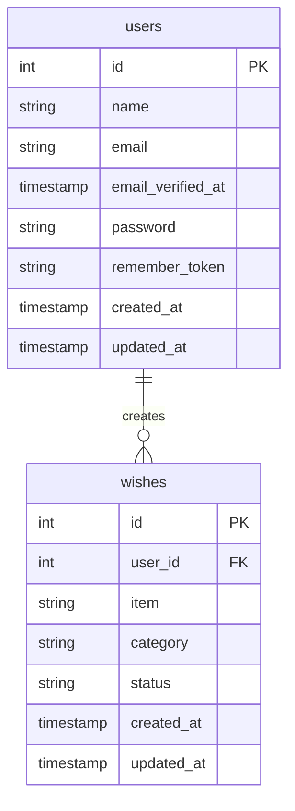

## ER図

```mermaid
erDiagram
    %% ユーザー
    users {
        int id PK
        string name
        string email
        timestamp email_verified_at
        string password
        string remember_token
        timestamp created_at
        timestamp updated_at
    }

    %% ウィッシュ
    wishes {
        int id PK
        int user_id FK
        string item
        string category
        string status
        timestamp created_at
        timestamp updated_at
    }

     %% リレーションシップ
    users ||--o{ wishes : "creates"

```